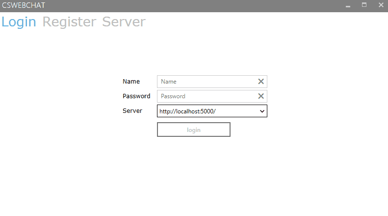

# CsWebChat
A small chat application written in C# using the Prism framework for the client as well as .Net Core for the backend.
Creator: P H, ph1387@t-online.de 

---

## Overview
Like the [Mp3Player](https://github.com/p1387h/CsPlayer) this project was mainly focused on learning / getting a glimpse at a new technology, which in this case was .Net Core. SignalR is used for the main communication between the desktop client and the server while it is also possible to request information by calling certain controllers in the backend. When building the application make sure to separate the server and WPF application. This is required since the latter one copies the different modules into its "modules" folder. A rogue "dotnet" process, used for building the server projects can interfere with that. The different components can be started as follows:

- Clients: Execute the generated .exe file
- Server: Run the "dotnet run" command in the "CsWebChat.Server" folder containing the "CsWebChat.Server.csproj" file.

## References
- [Prism](https://github.com/PrismLibrary/Prism)
- [MahApps.Metro](https://github.com/MahApps/MahApps.Metro)
- [SignalR](https://github.com/SignalR/SignalR)

## License
MIT [license](https://github.com/p1387h/CsWebChat/blob/master/LICENSE.txt)